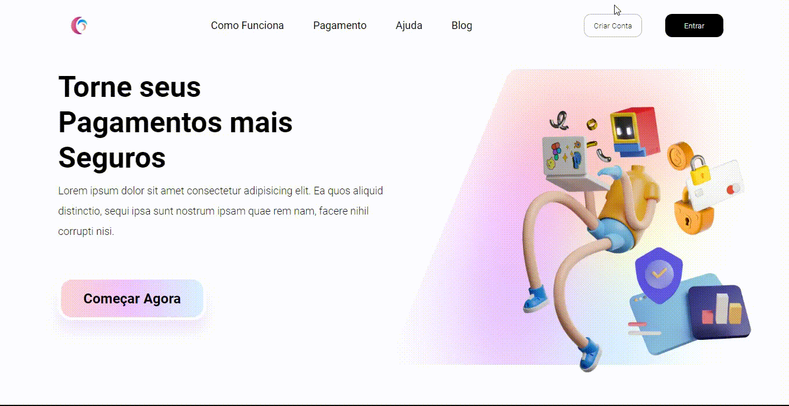

# Lading Page de Pagamento

> Projeto desenvolvido para treinar meus conhecimentos em CSS.

![html-image]
![css-image]

## ❕ Créditos

Criei esse projeto seguindo um Layout que encontrei na página da Comunidade do [Figma](https://www.figma.com/community), portanto o que crei foi apenas o código HTML e CSS.

O [Layout no Figma](https://www.figma.com/community/file/1107059844636605099) foi criado pelo Hamdy Elzonqali: [@hamdy34](https://www.figma.com/@hamdy34) – Todos os direitos do Layout original são dele.

## 📱 Minhas Redes Sociais

Instagram: [@rgvieiraoficial](https://www.instagram.com/rgvieiraoficial/).

Linkedin: [@yamirenato](https://www.linkedin.com/in/yamirenato/).

[html-image]: https://img.shields.io/badge/-html-orange
[css-image]: https://img.shields.io/badge/-css-blue
